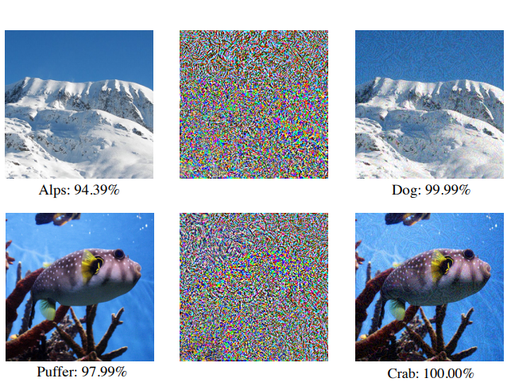
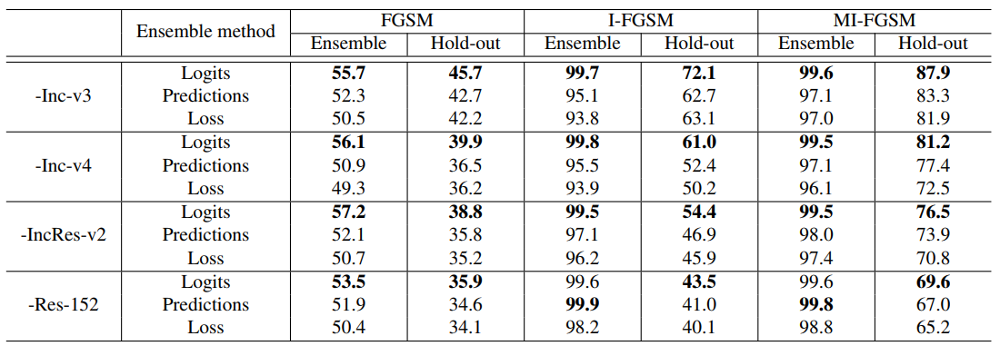

# Boosting Adversarial Attacks with Momentum

#### Yinpeng Dong, Fangzhou Liao, Tianyu Pang, Hang Su, Jun Zhu, Xiaolin Hu, Jianguo Li

  

### Abstract

This work introduces momentum based optimization for adversary generation, which help to craft effective black-box adversaries. This attack won the first place in NIPs 2017 Targetted/Non-Targetted Adversarial Attack contest.

### What it does

Introduces momentum based update in I-FGSM to yield effective black box attackers.

### How is it done

The Accumulated Gradients from each iteration of update is used to stabalize the optimization process. 

Further ensemble approaches for crafting adversarial perturbations are utilized.

### Chief Novelty

Using Momentum for adversary generation optimization and using an ensemble of models to increase the potency for black-box attack.

### Other Interesting Analysis

Show that black box approach is working even for models which have undergone ensemble adversarial training.

### Impressive Results

  

