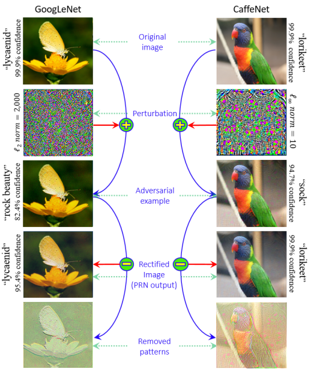
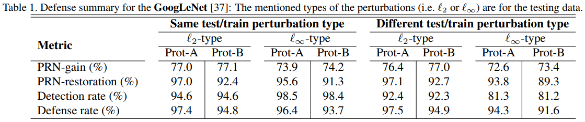

# Defense against Universal Adversarial Perturbations

#### Naveed Akhtar*, Jian Liu*, Ajmal Mian

  

### Abstract

This work introduces a `Perturbation Rectifying Network`, which learnt to rectify adversarial images
which have been injected with Universal Adversarial Perturbations. 

### What it does
Provides a `Perturbation Rectifying Network` (PRN), which classifies images as attacked by UAPs or not,
and rectify image if required. This Network can be used as a preprocessing step before common 
image recognition pipelines.
 
### How is it done
The PRN takes as input the adversarial image, and outputs the rectified image (actually outputs rectification signal). This network is trained
to match the classification of the rectified image to the classification of the clean image.

The Binary classifier for detection takes as input the adversarial and rectified image, and is 
fully supervised based on the training.

Further, using the lower dimensional subspace of UAPs, more UAPs are created to create a 
divers set of adversarial images. 

### Chief Novelty
Proposing a defense mechanism which explicitly try to combat UAPs. Innovation in the defense pipeline
and metrics proposed. 

### Other Interesting Analysis

* Use SVMs on top of 2D-DCT coefficients on (adversarial image - rectified image) to perform binary classification.

**Drawbacks**: Use only one UAP generation algorithm to test the efficacy of the defense. Does not report typical statistics
such as fooling rate/accuracy directly. Only analysed for smaller models on Imagenet.

### Impressive Results

The Proposed Metrics using different attacking strategies on GoogleNet Network for Imagenet dataset. 
Kindly read the paper for more information!

  

