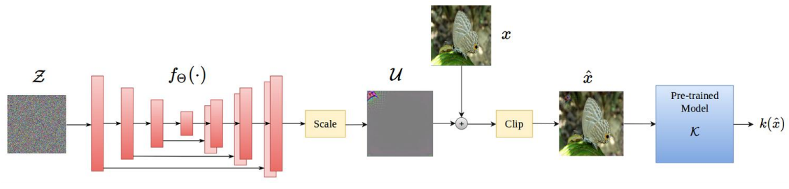
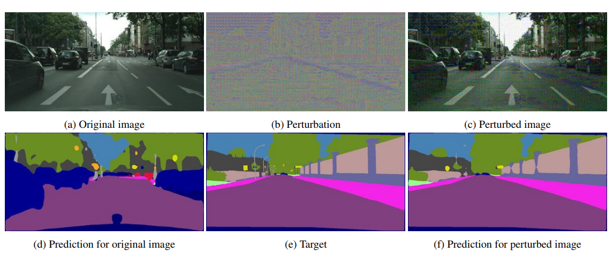

# Generative Adversarial Perturbations

#### Omid Poursaeed, Isay Katsman, Bicheng Gao, Serge Belongie

  

### Abstract

This work introduces a Generative approach for crafting image dependant and agnostic perturbations
which can be extended to different tasks and for the first time, enable targeted UAPs.

### What it does
Provides an autoencoder-like architecture which outputs perturbations (conditioned on the input image or noise)
which are adversarial to the network(s) it was trained on.
 
### How is it done
The network is trained with similar loss formulation as typical adversarial attacks such as `FGSM`/`PGD`,
with the exception that the network learns to create such perturbations rather than perform 
gradient update to generate them. 

### Chief Novelty
Providing a generalized generative framework for targeted UAPs.

### Other Interesting Analysis

* Authors tried different loss formulations (Least Likely vs Most Likely).

* Perturbations trained to fool multiple networks have better attacking capability on other networks. 

**Slight Drawback** : The fooling rate for non-targeted image dependant adversaries is quite lower than 
simpler methods such as `iFGSM`.

### Impressive Results

The results on attacking a segmentation network.

  

