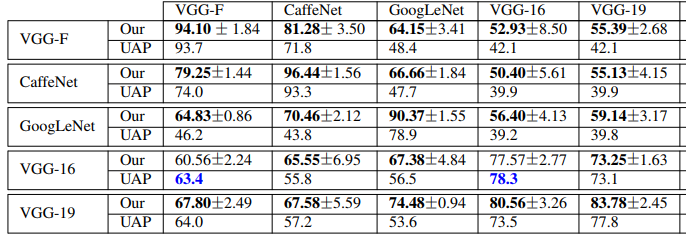

# NAG: Network for Adversary Generation

#### Konda Reddy Mopuri*, Utkarsh Ojha*, Utsav Garg and R. Venkatesh Babu

  

### Abstract
The authors propose using a GAN based approach to learn the manifold of image-agnoistic adversarial perturbations. The network is trained to produce strong perturbations, which exhibit wide variety and show cross model generalizability.

### What it does
Learns a Generative model which, given a latent space sample, returns a Universal adversarial perturbation.

### How is it done
The Generator(with output clampled to the required range) is trained to generate noise. This noise is then added to images from the normal image manifold and passed through a target classification model. The generator is trained to increase the loss at the output of the target classification model which the capability of only affecting the generated noise.

Further, to enhance diversity among the samples generated, a diversity objective is introduced. 

### Chief Novelty

A genrative model for modelling the manifold of universal perturbations.

### Other Interesting Analysis

* The manifold of learnt perturbations is shown and is interesting.

* The generator exhibits cross model generalizability.

* The generator is also trained for targetting multiple architectures, further enhancing its generalizability. 

**Drawback** :  

* No study on the different objectives for training. 

* Targetted Universal Perturbations have not been attempted.

### Impressive Results

  

