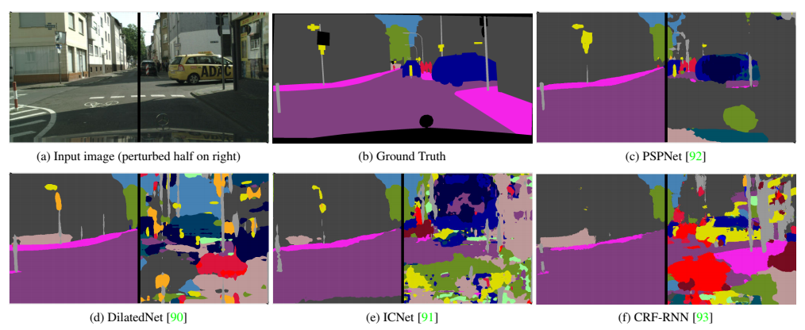
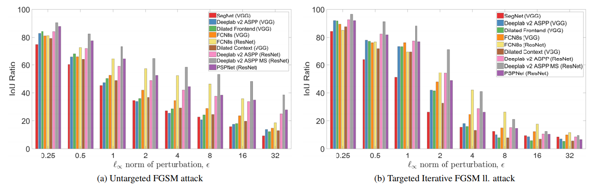

# On the Robustness of Semantic Segmentation Models to Adversarial Attacks

#### Anurag Arnab, Ondrej Miksik, Philip H.S. Torr

  

### Abstract

This work presents a rigorous analysis of adversarial attacks on segmentation networks, and provides insights based on
the analysis.

### What it does

Benchmarks adversarial attacks on various segmentation models and datasets. Further provide some hypothesis based on
the experiments.
 
### How is it done

By conducting extensive evaluation of various segmentation across different attacks with different configurations. It
is really massive evaluation!

### Chief Novelty

Presents first rigorous evaluation of the robustness of semantic segmentation models to adversarial attacks.

### Other Interesting Analysis

* Show that Models with residual connections are more robust.

* Multi-scale processing, frequently used in segmentation, also provides stronger defense.

* Mean-field inference for Dense CRFs, which increases the confidence of predictions confers robustness to 
**untargeted attacks**.

**Drawback** : 

* Previous segmentation attacking works cited, but not compared against in tables.

* Strongest of attacks such as CW/PGD not used. 

### Impressive Results

The results on attacking a different segmentation networks:

  

