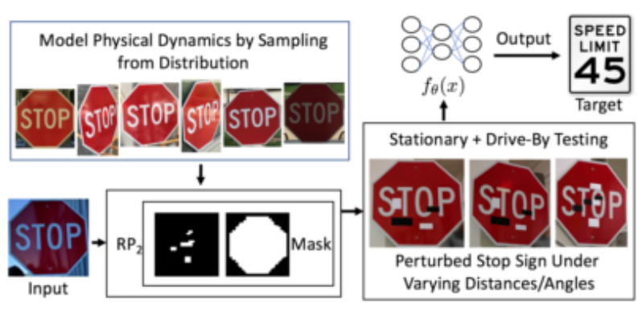
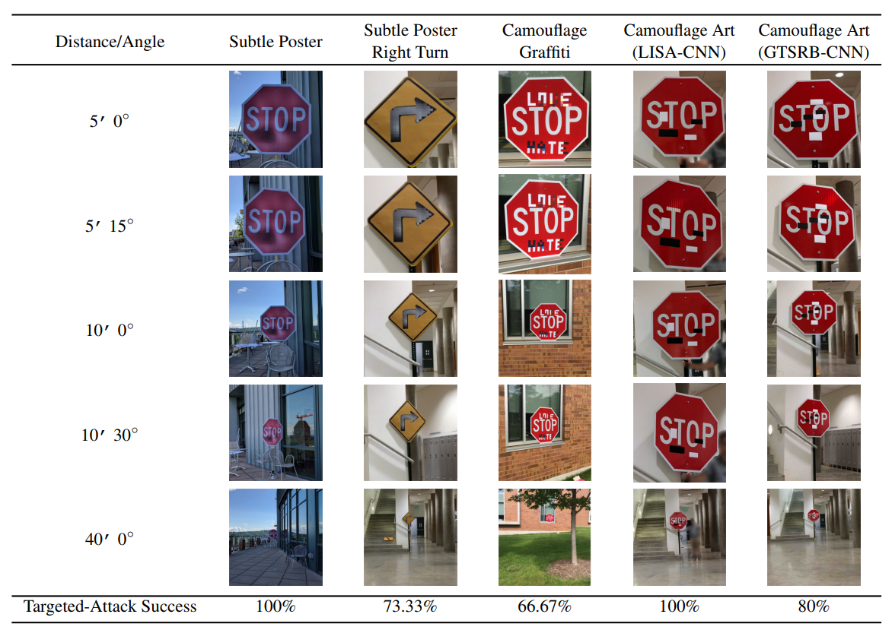

# Robust Physical-World Attacks on Deep Learning Visual Classification

#### Kevin Eykholt, Ivan Evtimov, Earlence Fernandes, Bo Li, Amir Rahmati, Chaowei Xiao, Atul Prakash, Tadayoshi Kohno, Dawn Song

  

### Abstract

This work presents `RP2`, a method to generate adversarial perturbations (object constrianed poster or sticker based attack) which remain adversarial under different physical conditions, which is further validated by conducting lab and field tests.

### What it does

Presents algorithm from generating robust adversarial perturbations.

### How is it done

Similar to Expectation of Transformation attack, we maximize the loss over a distribution of images which are just Transformation of the image which we want to create robust adversaries for. 

Here, transformations are affected by physical conditions like changing light/distance/angle etc. Additionally masking is used to ensure only the object is perturbed, and to ensure that attacks happen on the `weak physical feature` spots(?).

Finally the Non-Printable Loss is also used to penalize printing errors. 

### Chief Novelty

Conducting Drive-By (Field) evaluation of robust perturbations, and introducing sticker attacks. 

### Other Interesting Analysis

They show the attack for inception v3 trained on imagenet for two classes: Microwave and Cups, where the attack shows high success rate!

**Drawback** : No Black-box attack analysis presented. 

### Impressive Results

  

