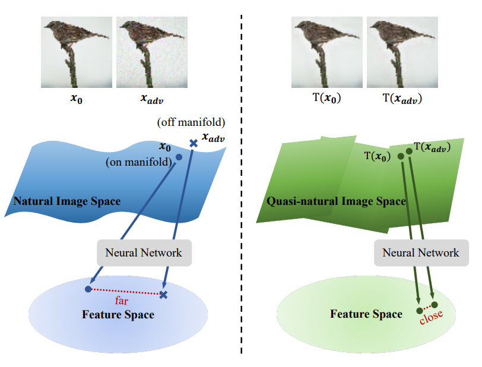
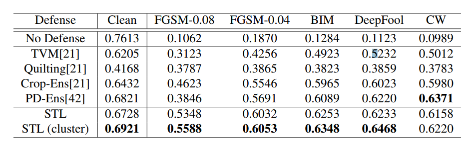

# Adversarial Defense by Stratified Convolutional Sparse Coding

#### Bo Sun, Nian-hsuan Tsai, Fangchen Liu, Ronald Yu, Hao Su

  

### Abstract

The authors propose an approach to denoise the image based on convolutional sparse coding. They utilize a novel sparse transformation layer to project adversarial images into quasi-natural image space before feeding it to the first layer of the target CNN, achiving state-of-the-art defense against attacks from multiple methods and scales.  

### What it does

Given a image, it is 'denoised' using learnt sparse convolutional coding before prediction from a target classifier.  

### How is it done

* Using a DAE we split the image manifold into different clusters.

* For each cluster 
  * A set of filters are learnt (dictionary learning) using ADMM algorithm in the Fourier domain (?).
  * Sparse Code for combining the filters to reconstruct input images is found by solving a convex optimzation problem.
 
* The network is trained on the reconstructions from the above step.

* At test time, each image is reconstructed usign the above method and passed to the trained network for prediction.

### Chief Novelty

This method is attack-agnostic, and scales to higher noise than other attack-agnostic methods by using a Sparse Transformer Layer.

### Other Interesting Analysis

* Show that their method remains effective with different scales of data. 

* The manifold of image is broken into clusters using DAE to provide different subsets to learn filters for. 

**Drawback** :  

* What if the attack is directed towards ensuring it ends up in wrong strata from the DAE? 

* It is necessary to train the network on the "quasi-natural image space". Effective Denoising to Image space (which does not exist currently) would allow using the defense without retraining.

* A plot between accuracy and the number of clusters in DAE would be super interesting!

### Impressive Results

Performance on Imagenet for ResNet-50 Model across different defense strategies.

  

