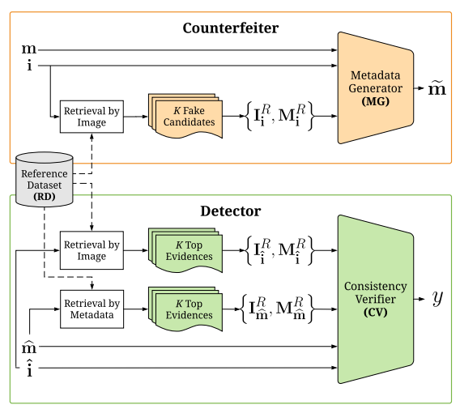
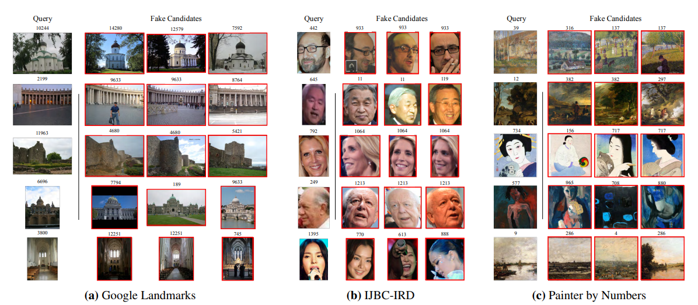

# AIRD: Adversarial Learning Framework for Image Repurposing Detection

#### Ayush Jaiswal, Yue Wu, Wael AbdAlmageed, Iacopo Masi, Premkumar Natarajan

  

### Abstract

This work introduces an image repurposing detection method based on  adversarial learning and validate it across repurposing of location-identity, subject-identity and painting-artist. 

### What it does

Given an image and a caption, using a reference database, it discerns weather the caption is related to the image or not.

### How is it done

Two networks are trained in an adversarial setup. The Counterfeiter tries to genrate the most effective false image-caption pair, while the detector performs content verification to decide weather the sample is real or a fake. 

Both the networks have access to a reference dataset. The Counterfeiter queries the reference dataset for the nearest matching fake captions from the dataset. The detector queries the reference datset for the nearest matching captions as well as images for a given pair, utilizing all of them for classifying as fake or true.

### Chief Novelty

Proposal of an interesting method to detect image repurposing, which is a important problem in the current age.

**Drawback** 

* The effect of the sub parts which are non-trainable, such as the retrieval method from the database is not explored.

* Its hard to understand what is the caption assigned by the Counterfeiter as its a soft combination of the encodings.

* Human engineered repurposed image samples (instead of the Counterfeiter) as a test bed would have been a great experiment.

### Impressive Results

  

