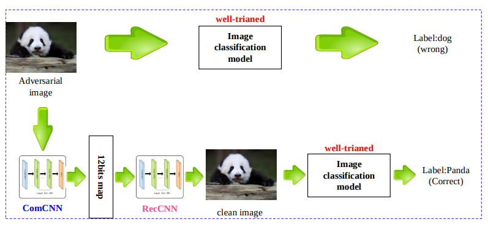
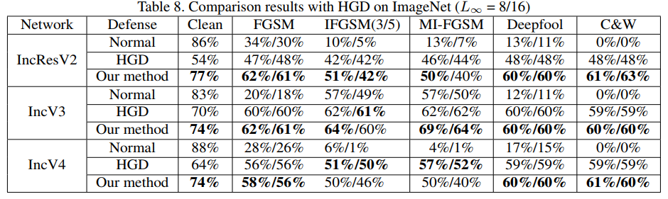

# ComDefend: An Efficient Image Compression Model to Defend Adversarial Examples

#### Xiaojun Jia, Xingxing Wei, Xiaochun Cao, Hassan Foroosh

  

### Abstract
Authors propose a denoising autoencoder inspired defense. 

### What it does
Given an input image, the method uses a denoising approach based on an autoencoder to reconstruct the clean image. 
This clean image is (hopefully) classified correctly.

### How is it done
The 24 bit image input is passed through the encoder ComCNN to get a compact 12-bit encoding (12-bit depth wise). 
This encoding (with noise) is then passed to the RecCNN to reconstruct the clean image, which is passed to the target
classifier network.

### Chief Novelty

Using noise in the encoding while reconstruction as well as using sparsity loss for the encoder. This yields a more 
data efficient adversarially denoising autoencoder.

**Drawback** :  

* The improvement from HGD is a little less for many networks.

* Unclear if these are complete white box attacks (attacker has knowledge of defense used).

* The loss L2 has to be used for ComCNN as well, but is not mentioned explicitly.

* Would have been nice to see attack using BPDA (Gaussian noise input in the encoding acts as a randomizer).

### Impressive Results

  

