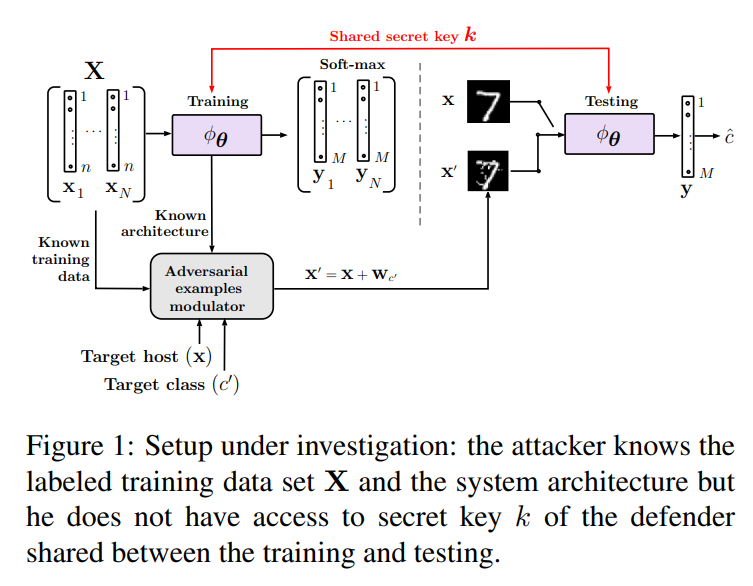

# Defending against adversarial attacks by randomized diversification

#### Olga Taran, Shideh Rezaeifar, Taras Holotyak, Slava Voloshynovskiy

  

### Abstract
Authors introduce a multi-channel architecture, which uses different randomization per channel based on a secret key 
shared only between the training and testing agents.

### What it does

### How is it done

### Chief Novelty

### Other Interesting Analysis

* Meta: The paper has only 15 References! Very Directed paper! 

**Drawback** :  

### Impressive Results

  

