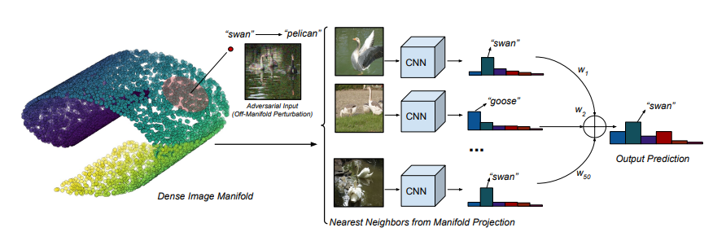
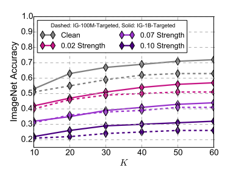

# Defense Against Adversarial Images using Web-Scale Nearest-Neighbor Search

#### Abhimanyu Dubey, Laurens van der Maaten, Zeki Yalniz, Yixuan Li, and Dhruv Mahajan

  

### Abstract
The authors propose utilizing nearest-neighbor retrieval for 're-projecting' adversarial sample into natural image
space. Further, they propose attack methods to break such a retrieval based defense.

### What it does

The method utilizes a massive image dataset (to perform retrieval) which is used as a defense against adversarial
samples.

### How is it done

Given an input image, we perform Nearest neighbor search for the image features (intermediate representations at
some layer) in the image dataset. 

For each of the recovered images we obtain the target network's output. 

Different weighting schemes are proposed by the authors to combine the predictions.

### Chief Novelty

Introducing massive database search as a defense mechanism.

### Other Interesting Analysis

* The used image dataset has ~50 Billion images!

* Different weighting schemes are explored for utilizing the nearest neighbors found.

* Experimentally explore the effect of space of nearest neighbor search (which layer representation etc.)

**Drawback** :  

* Only works in black-box and gray-box scenario. The defense fails if the attacker is aware of the retrieval system.

### Impressive Results

Gray and Black box attack on Resnet 50 at different strenghts and different nearest-neighbor pool.

  

