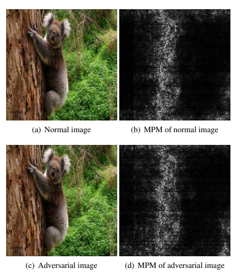
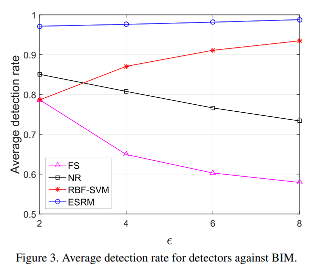

# Detection based Defense against Adversarial Examples from the Steganalysis Point of View

#### Jiayang Liu, Weiming Zhang, Yiwei Zhang, Dongdong Hou, Yujia Liu, Hongyue Zha and Nenghai Yu

  

### Abstract
The authors propose to enhance steganalysis features by estimating the probability of modifications caused by 
adversarial attacks, which helps them detect adversarial examples. 
### What it does

### How is it done

* Stated assumption: The perturbation of pixel values by adversarial attack alters the dependence between pixels. By 
modeling the differences between adjacent pixels in natural images, they identify deviations due to adversarial attacks.

* Consider two kinds of features low-dimensional as well as high-dimensional. 

* Image locations with large gradients have high probability of change from attack. Give feature from those locations 
more weight.

* Finally uses high-dimensional artificial features and FLD (Fisher Linear Discriminant) ensemble instead of NN on the
extracted features to classify as adversarial or not.

### Chief Novelty

* Using a non-diffrentiable attack detector on image features which model the relation between adjacent pixels, and 
enhancing it by using Modification probability for each pixel. 

### Other Interesting Analysis

* Introduce the term secondary adversarial attacks: attacks on the detection method to avoid detection of adversarial 
attack.

**Drawback** :  

* This work assumes the knowledge of the attacking method. In real scenarios, this information may be unavailable. 
Suggested solution from authors: train one model for each attack.

* Different ways of computing the Modification probability map for different attacks.

* Method does not work well with smaller image size datasets like MNIST (a first in defenses afaik!).

* Comparison with other detectors formulations(instead of FLD) would have been nice!

* An attack may explicitly try to minimize difference in the features they extract, i.e. white box attack. No results
are shown with such attacks.

### Impressive Results

  

