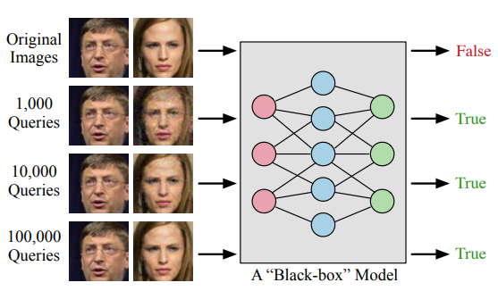
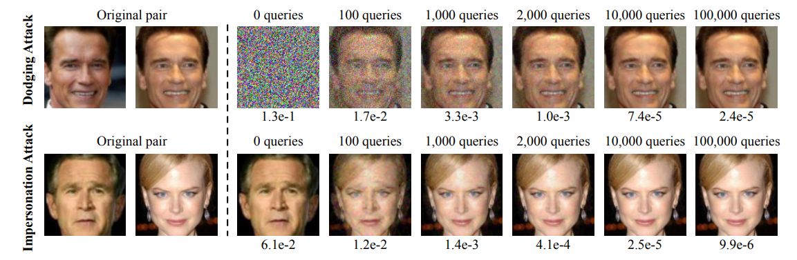

# Efficient Decision-based Black-box Adversarial Attacks on Face Recognition

#### Yinpeng Dong, Hang Su, Baoyuan Wu, Zhifeng Li, Wei Liu, Tong Zhang, Jun Zhu

  

### Abstract

This work proposes a evolutionary attack algorithm, which, by modeling the local search directions, enables a faster and more effective attack. This attack is then utilized to attack real world face-recognition web service.

### What it does

Given a image and a target class, we start from a sample of the target class and iteratively move it towards the given image such that the target class label prediction is maintained. This work utilizes many tricks to make this process efficient.

### How is it done

* Uses (1+1)-CMA-Evolution Strategy.
  
  * In each update iteration, a new offspring (candidate solution) is generated from its parent (current solution) by adding a random noise, 

  * The objective of these two solutions are evaluated, and the better one is selected for the next iteration.

* Other tricks include:
  
  * Initialization

  * Stochastic Coordinate Selection

  * Search Space Dimensionality reduction

### Chief Novelty

Improving Black Box attack for classification and utilizing it to attack a real world face verification platform.

### Other Interesting Analysis

* Ablations across the various components of the optimization (such as the dimension reduction etc.) is performed.

### Impressive Results

  

**Note**: I am not well aware of the optimization methods utilized by this paper. Hopefully there are no mistakes in the interpretation! 

