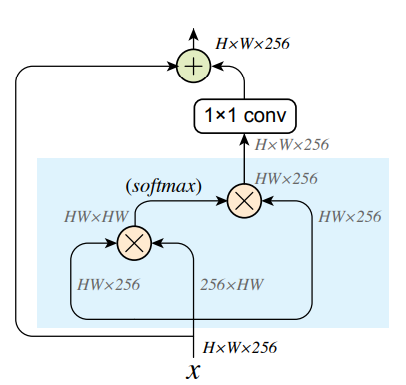
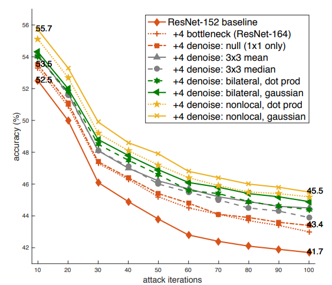

# Feature Denoising for Improving Adversarial Robustness

#### Cihang Xie, Yuxin Wu, Laurens van der Maaten, Alan Yuille, Kaiming He

  

### Abstract
This work introduces layers which perform feature denoising using filters such as non-local means, which when combined 
with adversarial training, substantially improves state-of-the-art in white box as well as black-box attack scheme!.

"Ranked first in Competition on Adversarial Attacks and Defenses (CAAD) 2018."

### What it does
The proposed model and training enables us to create highly robust (compared to previous works) models.
 
### How is it done
The network is augmented with denoising blocks (see image). Finally its used along with PGD training to create 
adversarially robust models.

### Chief Novelty
Spectacular performance increase: under 10-iteration PGD white-box attacks where prior art has 27.9% accuracy, this
method achieves 55.7%.

### Other Interesting Analysis

* Non-local means is used for denoising, but residual connections and `1x1` convolutions are used for retaining the 
signal and feature combination.

* Try other variants such as local filters (bilateral, median and mean).

* Add only 4 denoising blocks to Resnet-101!

* In the clean setting, these denoising blocks have no obvious advantage over the baseline R152, adding standard 
bottleneck blocks, or adding “null” denoising blocks.

### Impressive Results

  

