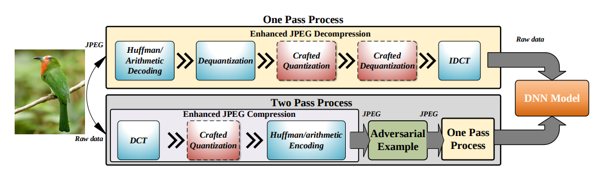
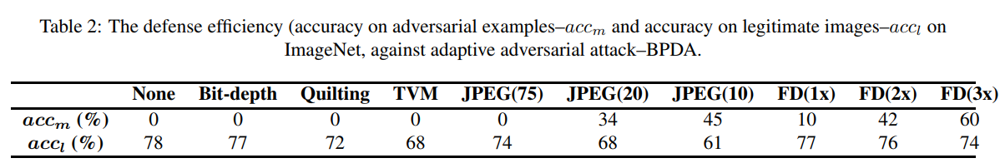

# Feature Distillation: DNN-Oriented JPEG Compression Against Adversarial Examples

#### Zihao Liu, Qi Liu, Tao Liu, Nuo Xu, Xue Lin, Yanzhi Wang, Wujie Wen

  

### Abstract

Based on JPEG compression, the authors propose a denoising feature-distillation method which significantly improves
defense against various attacks, without retraining the network.

### What it does
The input is passed through one of the two proposed "feature Distillation" compression, which removes the adversarial
 perturbation while retaining the clean image signal.

### How is it done
The authors propose two modes: 1) One Pass Process: Quantization/Dequantization only in the decompression phase of 
JPEG, and 2) Two Pass Process; Quantization in the standard JPEG compression phase as well.

For quantization, the value placed for each frequency coefficient is based on the gradients at the coefficient. The 
heuristic used to approximate that is the Frequency component analysis. Quantization error for coefficients with high
 value is reduced.

After DCT, the coefficients are rounded off based on set thresholds.

### Chief Novelty

Changing the standard JPEG compression to enhance its utility against adversarial perturbations. Additionally the 
results are highly encouraging.

### Other Interesting Analysis

* Introduce the notion that JPEG is engineered for Human visual system, where as the one required here does not 
have to be constrained by that.

* Mentions that JPEG compression is integrated in the sensor components itself!

* DCT transform is linear operation.
**Drawback** :  

### Impressive Results

  

