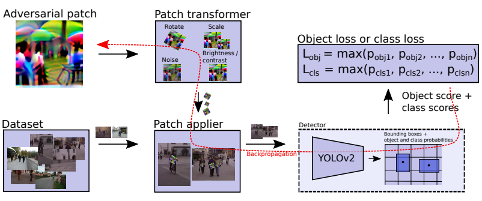
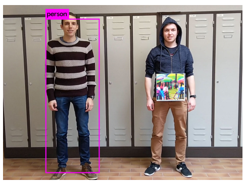

# Fooling automated surveillance cameras: adversarial patches to attack person detection

#### Simen Thys*, Wiebe Van Ranst*, Toon Goedeme´

<p align="center">
  
</p>

### Abstract

This work proposes an optimization to yield a printable patch which when used causes object detection to fail. The
proposed optimization enables crafting such perturbations for classes with high intra-class variance, such as humans.

### What it does

This work proposes an optimization to yield a printable patch, which when stuck to a target class (at a specific
location) disable the object detection network from detecting the object.

### How is it done

Firstly the patch is applied with various tranformations such as rotations scaling etc to ground truth bounded boxes of
object instances. 

These modified images are then fed to the target network to yield low object score for the target objects. 

Additionally, losses such as TV-norm and NPS are utilized to make the patch printable and smooth.

### Chief Novelty

Generating a single patch which can cause failure of human detection for all humans in all pose (but with some caveats).

### Other Interesting Analysis

* While this method works for various networks, these patches do not transfer well.

* The paper concludes with: 

```
We believe that, if we combine this technique with a sophisticated clothing simulation, we can design a T-shirt print 
that can make a person virtually invisible for automatic surveillance cameras (using the YOLO detector).
```

Would be really amazing to see this happen!


**Drawback** :  

* The patch has to be fixed at a specific location on the object. 

* No analysis provided for how this approach fares for other object classes.

### Impressive Results

<p align="center">
  
</p>
