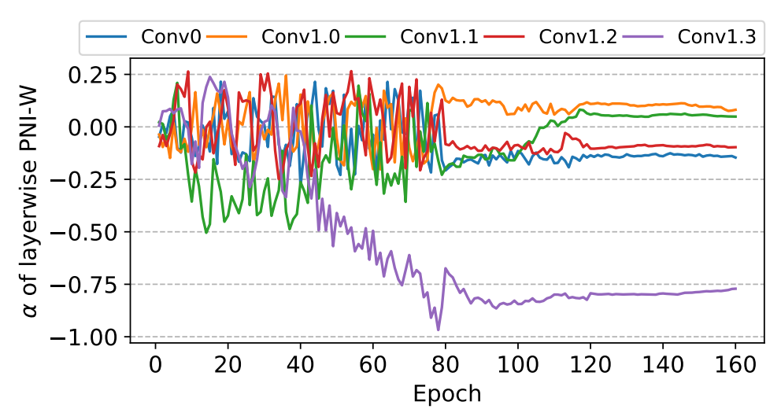
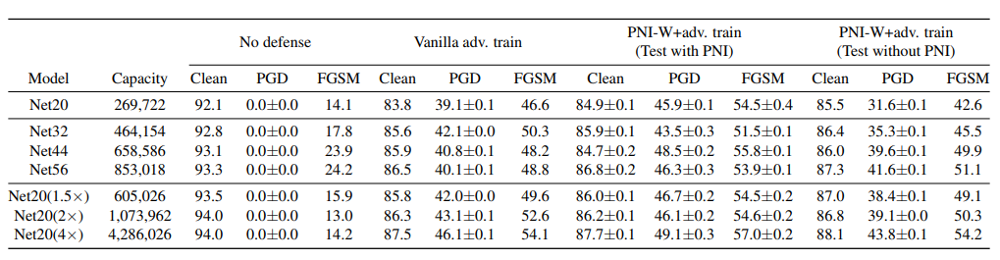

# Parametric Noise Injection: Trainable Randomness to Improve Deep Neural Network Robustness against Adversarial Attack

#### Adnan Siraj Rakin, Zhezhi He, Deliang Fan

  

### Abstract
This work introduces training parametric noise injection (PNI), which injects noise in weights or activations through 
solving a min-max optimization problem. Further, results show that PNI technique effectively improves the robustness 
against a variety of powerful white-box and black-box attacks and improves clean as well as perturbed data accuracy.

### What it does
Provides a training technique which yeilds models which have stronger defense against adversarial attacks.

### How is it done

Do PGD adversarial training but also have a parameter for the noise to be added to the weights. When generating the PGD 
samples, the noise parameters are optimized with the gradients as well.  

### Chief Novelty
Introduction "parametric' noise injection and creating a adversarial training method which also improves accuracy on 
clean images.

### Other Interesting Analysis

* Show that injecting noise only in the weights is better than injecting also in the activations.

* While testing, the accuracy of test samples is maintained even without using the noise generation (used while 
training).

* Provide analysis to justify that gradient obfuscation is not happening.

**Drawback** :  

* Test only on ResNet-20 on CIFAR-10. 

* For each parametric layer there is only one layer-wise noise scaling coefficient to be optimized. It would be 
interesting to see ablations in this direction. 

### Impressive Results

  

