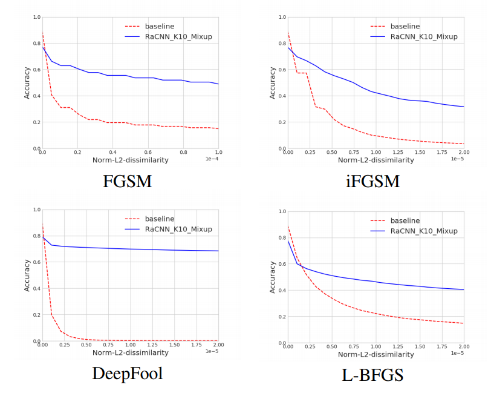
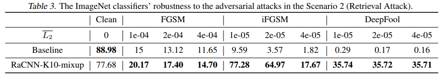

# Retrieval-Augmented Convolutional Neural Networks for Improved Robustness against Adversarial Examples

#### Jake (Junbo) Zhao, Kyunghyun Cho

  

### Abstract

This work proposes a retrieval augmented CNN, which mitigates the adverse effect of off-manifold adversaries. On manifold adversaries are handled by utilizing "Local-Mixup" which encourages linear behaviour on the manifold.

### What it does

The network performs a nearest neighbor search in forward pass. The found neighbors are then utilized to obtain the 'on-manifold' projection of the adversarial sample. This 'on-manifold' projection is claimed to be more robust to adversarial perturbations.

### How is it done

The network is trained with the retireval system in the loop. At each forward pass, the nearest neighors are found at a given layer, weighted combination of which is then utilized as a 'on-manifold' projection of the adversarial sample features.

Further, local mixup is utilized: Linear interpolation of features should result in Linear interpolation of output probs.

### Chief Novelty

Utilizing retrieval in the training loop itself along with local-mixup.

**Drawback** :  

* Strong attacks such as PGD have not been showed. 

* Results with training of feature extractor would have been intersting!

* The approach is not very effective currently for white box attack (not exactly a drawback, but a point to remember).

### Impressive Results

**Scenario 1: Black Box Attack**

  

**Scenario 2: White box attack**

  

